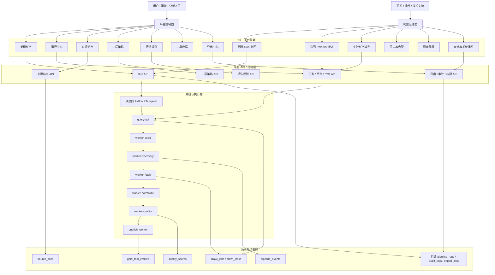

# 平台控制面与运维面结构图

> 目标：说明为什么你们需要“控制面”和“运维面”两种能力，但当前阶段不必拆成两套完全独立的平台。

## 1. 一句话结论

你们需要：

- 一个面向用户的 `平台控制面`
- 一个面向技术团队的 `爬虫运维面`

但当前更推荐：

- 先做 `一套统一后台`
- 在同一套后台里分出两类菜单、两类权限、两类页面

## 2. 通俗理解

- `平台控制面`：像作战指挥台，决定采什么、怎么采、结果怎么用
- `爬虫运维面`：像机房值班台，决定系统有没有挂、哪里堵了、谁失败了

所以：

- 控制面主要服务业务用户、运营、分析人员
- 运维面主要服务研发、技术支持、运维人员

## 3. 结构图

## 4. 如果你不看图，只看这几句话

最上面是两类人：

- 业务用户
- 技术用户

中间是一套统一后台，但里面分两个面：

- `平台控制面`
- `爬虫运维面`

再下面是你们自己的平台 API 和控制层。

最下面才是：

- 调度器
- query-api
- worker
- 数据表

也就是说：

- 用户不应该直接面对 worker
- 用户也不应该直接去操作 Airflow、Temporal、CrawlLab
- 这些系统更适合放在下面做支撑层

## 5. 每一层分别负责什么

### 5.1 平台控制面

负责：

- 下达任务
- 选择来源站点
- 选择三层策略
- 选择清洗规则
- 查看结果
- 导出结果

它回答的问题是：

- 我要采什么
- 这次怎么采
- 最终结果是什么

### 5.2 爬虫运维面

负责：

- 看队列是否堵塞
- 看 worker 是否异常
- 看失败任务和报错
- 看调度是否触发
- 看系统健康和日志

它回答的问题是：

- 为什么这次挂了
- 卡在哪一层
- 该重试哪个任务

### 5.3 平台 API / 控制层

这是你们真正要掌控的“产品主脑”。

它负责把业务动作变成系统动作，例如：

- 用户点击“新建任务”
- 平台生成 `run`
- 平台调用调度和执行链路
- 平台汇总状态、事件、结果、证据

### 5.4 编排与执行层

这一层更像基础设施。

它负责：

- 定时触发
- 重试机制
- worker 编排
- 具体采集执行

这层可以借助：

- `Airflow`
- `Temporal`
- 现有 worker 服务

### 5.5 数据与结果层

这一层负责存储：

- 任务数据
- 事件数据
- 来源站点配置
- 质量评分
- 最终工具结果
- 后续平台对象

## 6. 当前阶段最推荐的落法

当前最推荐的是：

- 不做两套独立前端
- 先做一套统一平台前端
- 用权限和菜单把“控制面”和“运维面”分开

这样有几个好处：

- 成本低
- 路由统一
- 登录统一
- 权限统一
- 审计统一
- 后续真有需要，再拆分也不晚

## 7. 对你们项目的直接建议

### 现在先重点做

- 平台控制面

包括：

- 新建任务页
- 运行中心页
- 运行详情页
- 来源站点页
- 三层策略页
- 工具数据页

### 运维面先做轻量版

包括：

- 活跃 run
- worker 状态
- 队列深度
- 最近失败任务
- 调度健康
- 错误日志入口

## 8. 最终判断

你们确实需要这两种能力：

- `控制面`
- `运维面`

但当前不需要这两种能力分别做成两套完全独立的平台。

现阶段最合理的方案是：

- `一套平台`
- `两个面`
- `一个控制层主脑`
- `下面挂调度器和 worker`
